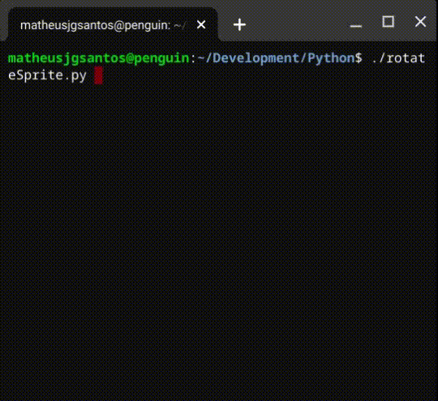

# rotateTinySprites
Python script to rotate sprites created using Jannone's [TinySprite](http://msx.jannone.org/tinysprite/tinysprite.html) webtool

##Usage

```./rotateSprite.py --help
usage: rotateSprite.py [-h] --input INPUT [--output OUTPUT] [--theta THETA]
                       [--interval INTERVAL] [--frames FRAMES]

Rotate sprites from tinysprite

optional arguments:
  -h, --help           show this help message and exit
  --input INPUT        Backup file from tinysprite
  --output OUTPUT      Destination file
  --theta THETA        Angle value
  --interval INTERVAL  Time interval between frames. Defaul=0.2
  --frames FRAMES      Number of frames to generate. Default=6.2
  --angle ANGLE        Value for the initial angle. Default=0
```


##Example

This is a small sample from the rotating script results:


